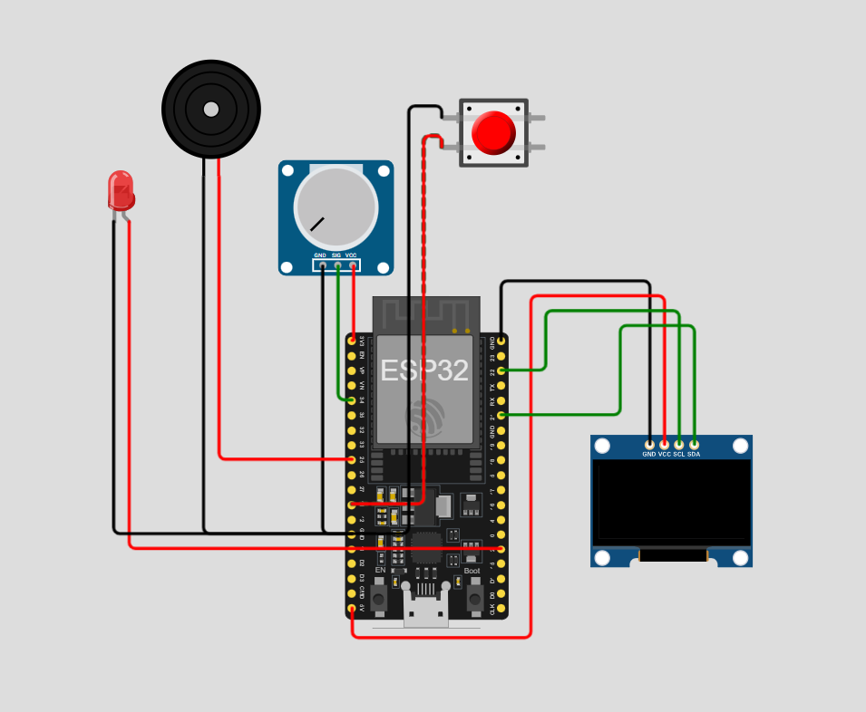

# **Lembrete de Remédios**

Este repositório implementa um sistema de **lembrete de medicamentos**, utilizando um ESP32, display OLED, potenciômetro, buzzer, LED e **push button**.
O horário do alarme é configurado através do potenciômetro, a confirmação do alerta é feita pelo botão, e a comunicação ocorre via protocolo MQTT, com sincronização de horário via NTP.

---

## 📷 Protótipo

> *Simulação feita no [Wokwi](https://wokwi.com/).*



---

## 🔧 Componentes Utilizados

* **Placa:** ESP32 DevKit C v4 (simulado no Wokwi)
* **Display:** OLED monocromático I2C
* **Entrada 1:** Potenciômetro (configuração do horário)
* **Entrada 2:** **Push Button** (confirmação do alarme)
* **Atuadores:** 1× LED de alerta, 1× buzzer piezoelétrico
* **Comunicação:** Wi-Fi + MQTT via `test.mosquitto.org:1883` + NTP para sincronização de horário

---

## ⚙️ Como Funciona

1. **Configuração do Horário**
   O potenciômetro ajusta o horário do alarme de 00:00 a 23:59.

2. **Sincronização de Horário**
   O ESP32 obtém o horário atual de um servidor NTP (GMT-3).

3. **Monitoramento do Horário**
   O microcontrolador compara o horário atual com o horário selecionado.

4. **Alerta de Medicamento**

   * Quando o horário coincide:

     * O **LED acende**
     * O **buzzer toca de forma intermitente**
     * O **display mostra aviso**
     * O sistema publica `"HORA DO MEDICAMENTO!!"` via MQTT

5. **Botão de Confirmação (Push Button)**
   O alarme só para quando o usuário pressiona o botão:

   * Buzzer desliga
   * LED apaga
   * Mensagem “Medicamento confirmado!” é exibida
   * O alerta não é disparado novamente naquele minuto

6. **MQTT**

   * Publicações:

     * `medicamento/hora` → horário configurado
     * `medicamento/alerta` → aviso de alarme

---

## 📁 Estrutura de Arquivos

```plaintext
├── sketch.ino       # Código principal do projeto
├── diagram.json     # Diagrama do circuito no Wokwi
└── libraries.txt    # Bibliotecas necessárias
```

---

## 🖲️ Push Button no Projeto

O botão é conectado ao **GPIO 14** usando **INPUT_PULLUP**, assim:

```
#define BUTTON_PIN 14
pinMode(BUTTON_PIN, INPUT_PULLUP);
```

O acionamento confirma o alarme:

```cpp
if (digitalRead(BUTTON_PIN) == LOW && lembreteAtivo) {
    noTone(BUZZER_PIN);
    digitalWrite(LED_PIN, LOW);
    lembreteAtivo = false;
    alarmeConfirmado = true;

    display.clearDisplay();
    display.setCursor(0, 25);
    display.println("Medicamento confirmado!");
    display.display();
    delay(1000); // debounce
}
```

---

## 🚀 Simulação no Wokwi

1. Entre em [https://wokwi.com](https://wokwi.com)
2. Crie um novo projeto
3. Envie os arquivos:

   * `sketch.ino`
   * `diagram.json`
   * `libraries.txt`
4. Clique em **Start Simulation**
5. Ajuste o **potenciômetro** e teste o **push button**

---

## Interfaces e Protocolos

* **Broker MQTT:** `test.mosquitto.org`
* **Porta:** 1883
* **Cliente:** PubSubClient
* **Transporte:** TCP/IP
* **Servidor NTP:** `pool.ntp.org` (GMT-3)

### Publicações MQTT

| Tópico               | Descrição                        |
| -------------------- | -------------------------------- |
| `medicamento/hora`   | Horário configurado (HH:MM)      |
| `medicamento/alerta` | Mensagem “HORA DO MEDICAMENTO!!” |

---

## 🔄 Possíveis Extensões

* Múltiplos horários programados
* Ajuste remoto via MQTT
* Dashboard Node-RED
* Registro histórico de tomadas
* Push button para adiar (snooze)

---

## 📜 Licença

MIT License — consulte o arquivo `LICENSE`.
